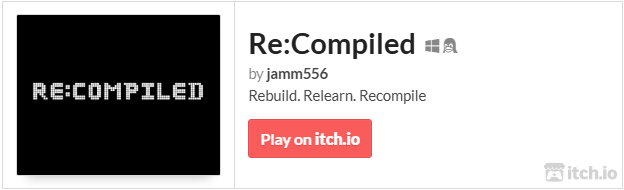

# 🎮✨ Re:Compiled – An Educational Platformer Adventure

**Re:Compiled** is a metaphor-driven 2D platformer that teaches core computer science concepts like object-oriented programming, computer architecture, and cybersecurity through story-based challenges and interactive gameplay. Designed for beginners, the game transforms abstract computing topics into intuitive puzzles and environments.

Play it now on itch.io: [https://jamm556.itch.io/recompiled](https://jamm556.itch.io/recompiled)

### 📁 Project Folder Structure

| Folder            | Description                                                |
| ----------------- | ---------------------------------------------------------- |
| addons            | Optional Godot plugins or editor tools                     |
| Assets            | All game assets including music, tilesets, UI, and effects |
| ├── Background    | Static background images and layers                        |
| ├── Font          | Custom fonts used in the game                              |
| ├── items         | Collectibles like medpacks and animations                  |
| ├── Json_data     | JSON files for structured data (e.g., dialogue, metadata)  |
| ├── Music         | Background music files                                     |
| ├── other         | Misc assets like buttons, coins, and keys                  |
| ├── platforms     | Platform designs and moving parts like gears and weapons   |
| ├── storyline     | Text or data for narrative flow                            |
| ├── Tilesets      | Level tileset images                                       |
| ├── UserInterface | UI elements for menus and HUD                              |
| └── Vfx           | Visual effects and shaders                                 |
| AutoLoad          | Global scripts auto-loaded at runtime                      |
| Build             | Exported builds of the game                                |
| Characters        | Sprites, scenes, and scripts for all characters            |
| ├── Companion     | Assets for companion character (e.g., Scout)               |
| ├── Enemy         | Enemy sprites, scenes, and behaviours                      |
| ├── NPCs          | Non-playable character assets                              |
| └── Protagonist   | Main player character assets and VFX                       |
| Dialogic          | Dialogic plugin data for timelines, styles, and characters |
| Game              | Game logic and levels                                      |
| ├── Level 0-5     | Level scenes and scripts                                   |
| ├── Menu          | Main menu scene                                            |
| └── UserInterface | In-game UI implementations                                 |
| Platforms         | Platform movement scenes and logic                         |
| Resources         | Game save data or player progress                          |
| Shaders           | Shader files for visual styling                            |
